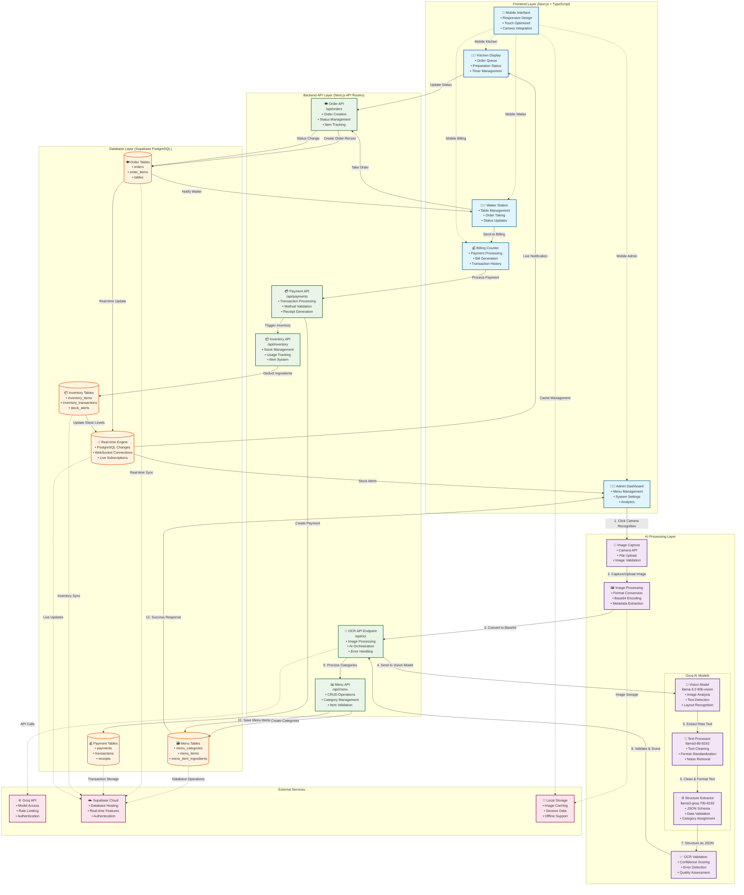

# Margros POS System

A comprehensive Point of Sale system built for restaurants and cafes, featuring AI-powered menu recognition, real-time order management, inventory tracking, and billing automation.

## ✨ Features

### 🍽️ Menu Management
- **AI-Powered OCR**: Extract menu items from photos using Groq's vision models
- **Category Management**: Automatic category creation and organization
- **Real-time Updates**: Live synchronization across all devices
- **Mobile Responsive**: Optimized for phones and tablets

### 📱 Order Management
- **Waiter Dashboard**: Table management and order taking
- **Kitchen Dashboard**: Order queue and preparation tracking
- **Real-time Status**: Live order status updates across stations

### 💰 Billing & Payments
- **Multi-Payment Methods**: Cash, Card, UPI, QR payments
- **Automatic Billing**: Smart bill generation with discounts
- **Inventory Deduction**: Automatic ingredient tracking
- **Payment History**: Complete transaction records

### 📦 Inventory Control
- **Smart Tracking**: Real-time inventory levels
- **Low Stock Alerts**: Automatic warning system
- **Usage Analytics**: Ingredient consumption tracking
- **CSV Import/Export**: Bulk inventory management

### 🔍 Camera Recognition
- **Menu Photo Upload**: Capture or upload menu images
- **Text Extraction**: Advanced OCR with confidence scoring
- **Structured Data**: Automatic menu item categorization
- **Image Storage**: Local storage with metadata

## 🚀 Tech Stack

### Frontend
- **Next.js 15** - React framework with App Router
- **TypeScript** - Type-safe development
- **Tailwind CSS** - Utility-first styling
- **Radix UI** - Accessible component library
- **Lucide React** - Beautiful icons

### Backend & Database
- **Supabase** - PostgreSQL database with real-time subscriptions
- **Groq API** - AI-powered vision and language models
- **Next.js API Routes** - Server-side functionality

### AI & OCR
- **Groq Vision Models** - llama-3.2-90b-vision-preview for image analysis
- **Text Processing** - llama3-8b-8192 for text cleaning
- **Structured Extraction** - llama3-groq-70b-8192-tool-use-preview for JSON schema

## 🏛️ Architecture

The application follows a modern full-stack architecture with AI integration. The frontend provides real-time interfaces for restaurant operations, while the backend orchestrates AI-powered menu recognition and data management. OCR capabilities process menu images directly through Groq's vision models for seamless menu digitization.



## 🛠️ Installation

### Prerequisites
- Node.js 18+ and npm/pnpm
- Supabase account and project
- Groq API key

### Setup

1. **Clone the repository**
   ```bash
   git clone https://github.com/Margroms/margros-pos-system.git
   cd margros-pos-system
   ```

2. **Install dependencies**
   ```bash
   npm install
   # or
   pnpm install
   ```

3. **Environment Variables**
   Create a `.env.local` file:
   ```env
   NEXT_PUBLIC_SUPABASE_URL=your_supabase_url
   NEXT_PUBLIC_SUPABASE_ANON_KEY=your_supabase_anon_key
   GROQ_API_KEY=your_groq_api_key
   ```

4. **Database Setup**
   Set up your Supabase database with the required tables:
   - `menu_categories`
   - `menu_items`
   - `tables`
   - `orders`
   - `order_items`
   - `payments`
   - `inventory_items`
   - `inventory_transactions`

5. **Run the development server**
   ```bash
   npm run dev
   # or
   pnpm dev
   ```

6. **Open the application**
   Navigate to [http://localhost:3000](http://localhost:3000)

## 📋 Usage

### Dashboard Navigation
- **Admin Panel**: Menu management and system settings
- **Waiter Station**: Table and order management
- **Kitchen Display**: Order preparation queue
- **Billing Counter**: Payment processing
- **Inventory Control**: Stock management

### OCR Menu Recognition
1. Navigate to Admin → Menu Management
2. Click "Camera Recognition" button
3. Capture or upload menu photo
4. Review extracted items
5. Upload to database

### Order Workflow
1. **Waiter**: Select table and add items
2. **Kitchen**: View and prepare orders
3. **Waiter**: Mark orders as served
4. **Billing**: Process payment and close table

## 🔧 Configuration

### Groq Models Used
- **Vision**: `llama-3.2-90b-vision-preview` - Image analysis
- **Text Cleaning**: `llama3-8b-8192` - Text processing
- **Extraction**: `llama3-groq-70b-8192-tool-use-preview` - Structured data

### Database Schema
The system uses PostgreSQL through Supabase with real-time subscriptions for live updates across all connected devices.

## 🤝 Contributing

1. Fork the repository
2. Create a feature branch (`git checkout -b feature/amazing-feature`)
3. Commit your changes (`git commit -m 'Add amazing feature'`)
4. Push to the branch (`git push origin feature/amazing-feature`)
5. Open a Pull Request

## 📄 License

This project is licensed under the MIT License - see the [LICENSE](LICENSE) file for details.

## 🆘 Support

For support and questions:
- Open an issue on GitHub
- Contact the development team
- Check the documentation

## 🚀 Roadmap

- [ ] Mobile app development
- [ ] Advanced analytics dashboard
- [ ] Multi-language support
- [ ] Integration with popular payment gateways
- [ ] Voice ordering capabilities
- [ ] AI-powered sales insights

---

Built with ❤️ by the Margros team
